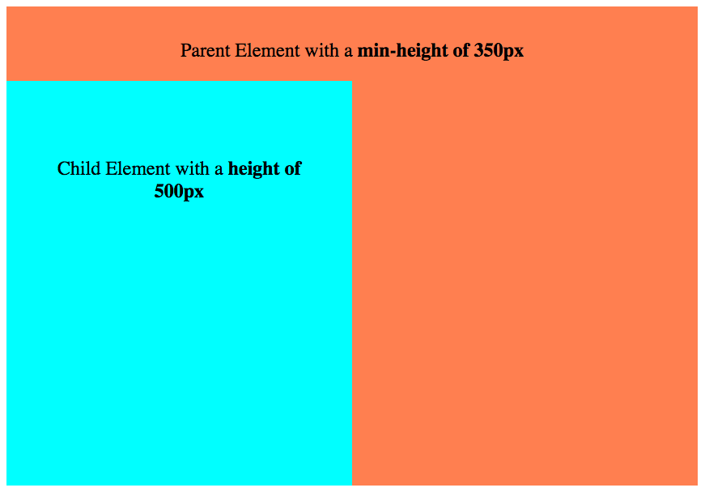
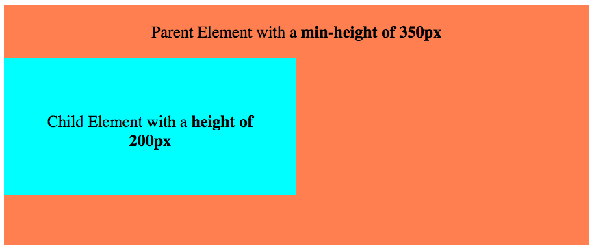
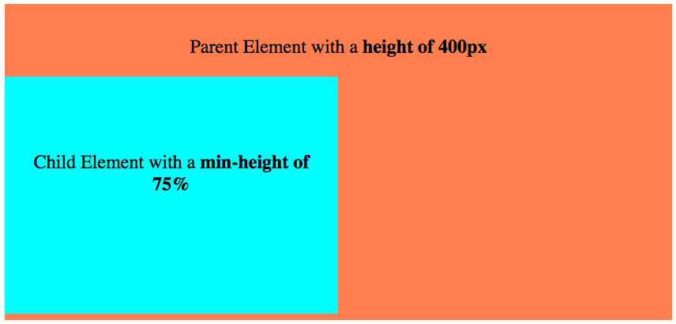
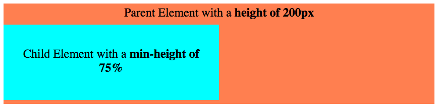

# The `min-height` Property
**CSS Property used to set the minimum allowable height of an element**

The `min-height` CSS property sets the minimum height measurement an element can exhibit.

When a minimum height is set, the styled element will render at no less than the height indicated by the property's value; however, the element might render at greater heights, depending on the size and layout of its content and child elements.

## Syntax and Application

Here's an example of the `min-height` property styling `div` elements with the `tall` class:

```
div.tall {
    min-height: <value>;
}
```

In the model above, <value> is a placeholder for a height measurement. Possible formats for this height measurement are discussed in greater detail below.

### Values

The `min-height` property has a default, or initial, value of 0 and thus does not apply until set specifically by the user. In addition, this property is not inherited by any child elements.

Accepted property values:

* Pixels
* Percentages
* Inherit

#### Pixels

If the value is set in pixels, the target element will not exhibit a height of less than the specified pixel amount.

```
fieldset#form {
    min-height: 400px;
}
```

In the example above, the fieldset with ID `form` will always have a height of at least 400 pixels. The fieldset could become taller, however, to accommodate child elements and content.

#### Percentages

If the value is set in a percentage, the target element will not exhibit a height of less than that percentage of the parent element's height.

```
fieldset#form div{
    min-height: 20%;
}
```

In the example above, any `div` element inside the `fieldset` with ID "form" will always have a height of at least 20% of the height of the `fieldset`. If the `fieldset` has a height of 1000 pixels, for instance, the child `div`s will exhibit a minimum height of 200 pixels (200 is equal to 20% of 1000).

#### Inherit

If the value of the property is set to `inherit`, the target element will inherit the `min-height` value of the closest parent whose minimum height is set. If no parent is styled by the property, the target element won't inherit a minimum height.

###Applicability
The `min-height` property can be applied to all elements except for inline elements and table elements.

## Example 1: A Parent with Minimum Height

In this example, we'll look at a parent div shaped as a pink block with the class of `parent`, and a child block-shaped div with the class of `child` inside of it.

Keep in mind that, by default, elements will automatically adjust height to fit the size of contents and child elements. In the example below, the child element has a height of `500px` and the parent element has a `min-height` of `350px`:



The styles for these two elements are as follows:

```
.parent {
    width: 60%;
    background: coral;
    margin: 30px auto;
    text-align: center;
    min-height: 350px;
}

.child  {
    width: 50%;
    background: cyan;
    text-align: center;
    padding: 30px;
    height: 500px;
}
```


Note that the parent block expands its height to accommodate the 500 pixel height of the child element.

Now let's see what happens when we shrink the child element down to 200px. If the parent had no minimum height set, we would expect it to shrink along with the child.  However, the `min-height` of `350px` prevents the height from falling below 350 pixels:



The new styles for these two elements are as follows:

```
.parent {
    width: 60%;
    background: coral;
    margin: 30px auto;
    text-align: center;
    min-height: 350px;
}

.child  {
    width: 50%;
    background: cyan;
    text-align: center;
    padding: 30px;
    height: 200px;
}
```


The parent element doesn't shrink down to match the height of the child. Instead, it maintains its minimum height of 350 pixels, as dictated by the `min-height: 350px` declaration.

## Example 2: A Child with Minimum Height of 75%

In this example, we'll look at the parent and child blocks from the last example with some slightly different styling. This time, we'll give the child element a minimum height of 75%, which will ensure the child doesn't exhibit a height of below 75% of its parent's height.

Here are the elements with the parent element's height set to `400px` and the child's `min-height` set to 75%:



The styles for these two elements are as follows:

```
.parent {
    width: 60%;
    background: coral;
    margin: 30px auto;
    text-align: center;
    height: 400px;
}

.child  {
    width: 50%;
    background: cyan;
    text-align: center;
    padding: 30px;
    min-height: 75%;
}
```


The child element does not have a static height; rather, its height is dynamic and will always be at least 75% of the parents height. Note, however, that the child's height can grow larger than the parent's height.

Now let's set the parent's height to `200px` and see how the child's height responds:



The new styles for these two elements are as follows:

```
.parent {
    width: 60%;
    background: coral;
    margin: 30px auto;
    text-align: center;
    height: 200px;
}

.child  {
    width: 50%;
    background: cyan;
    text-align: center;
    padding: 30px;
    min-height: 75%;
}
```


The child element shrinks down to maintain a height of 75% of the parent. Thus, we observe that percentages can prove useful when we want elements to adapt to the height of their parents, parents that might exhibit variable heights on the webpage.

## Compatibility

### Desktop

| Chrome  | Firefox | Internet Explorer | Opera | Safari |
|:-------:|:-------:|:-----------------:|:-----:|:------:|
|   Yes  |   Yes   |       Yes         |  Yes  |  Yes   |

### Mobile

| Android  | Firefox Mobile | IE Phone | Opera Mobile | Safari Mobile |
|:--------:|:--------------:|:--------:|:------------:|:-------------:|
|    Yes   |        Yes     |   Yes    |      Yes     |      Yes      |
